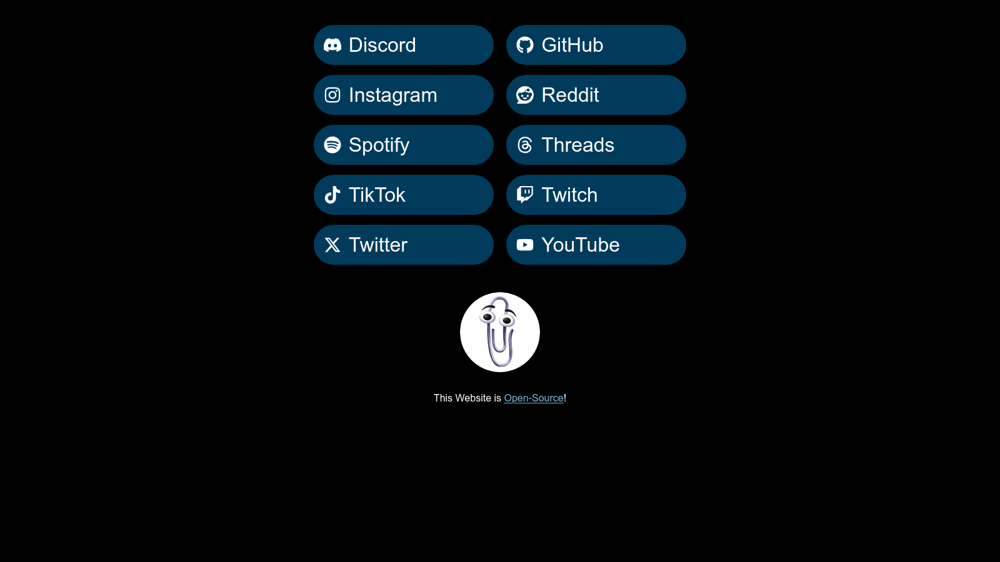

# MyLinks

A simple, Open-Source personal links page for [Nikoboi](https://nikoboinftb.github.io/MyLinks/).  

It provides a clean, responsive way to display all my social profiles in one place.  

You are free to fork this into your very own links website, with custom text, colors and images. It's simple and scaleable. Do reach out to me for adding support for more website icons.  

---

## 🌐 Website is Live

**Website:** [https://nikoboinftb.github.io/MyLinks/](https://nikoboinftb.github.io/MyLinks/)  
**Source Code:** [https://github.com/NikoboiNFTB/MyLinks](https://github.com/NikoboiNFTB/MyLinks)

---

## 🧠 About

**MyLinks** is a minimal, static web page built with **HTML** and **CSS**.  

It lists links to various social media platforms in a visually consistent and mobile-friendly layout.  

No JavaScript, frameworks, or dependencies — just pure, fast web design.  

---

## ✨ Features

- Simple dark-themed design (light theme not supported)  
- Responsive layout (desktop and mobile)  
- Hover effects on links  
- Easy to customize and host  
- 100% open-source  

---

## ⚙️ Setup and Customization

1. **Fork the repository**
   - Go to the [MyLinks](https://github.com/NikoboiNFTB/MyLinks) repository.
   - Click the **Fork** button in the top right corner to create a copy of the repository under your own GitHub account.
2. **Edit links**  
   - Open `index.html` and replace;
     - The Title.
     - The Favicon.
     - The profile image
       - To do this, replace `assets/clippy.jpg` file with another file.
     - The URLs inside the `<a>` tags with your own social links.
   - Also feel free to edit other parts of `index.html`, `assets` or `style.css`.
3. **Deploy using GitHub Pages** (or self-host)  
   - Go to your repository on GitHub.  
   - Open **Settings → Pages**.  
   - Under *Source*, choose your branch (`main`) and folder (`/root`).  
   - Click **Save**.  
   - Your page will be available at:  
     - `https://<your-username>.github.io/<your-repository>/`
     - Or your custom domain, if set up.

---

## 💡 Inspiration

This project serves as a simple, self-hosted alternative to services like Linktree, allowing full control over design, privacy, and content. No limitations!

---

## 🧾 License

This project is licensed under the **GNU General Public License v3.0 (GPLv3)**.  
See the [LICENSE](LICENSE) file for more details.

---

**Made by [Nikoboi](https://github.com/NikoboiNFTB)**
